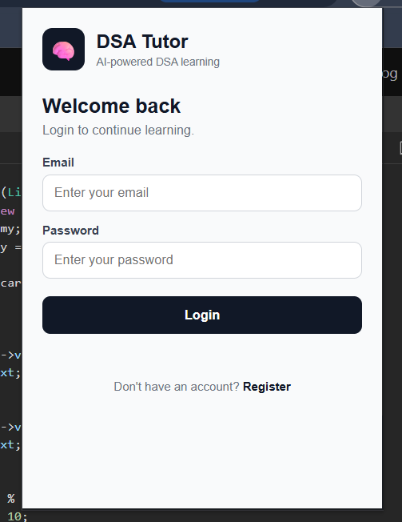
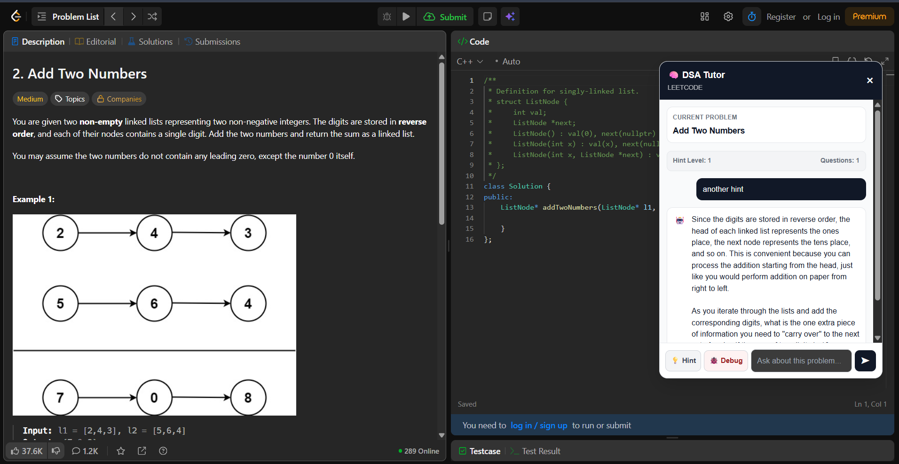
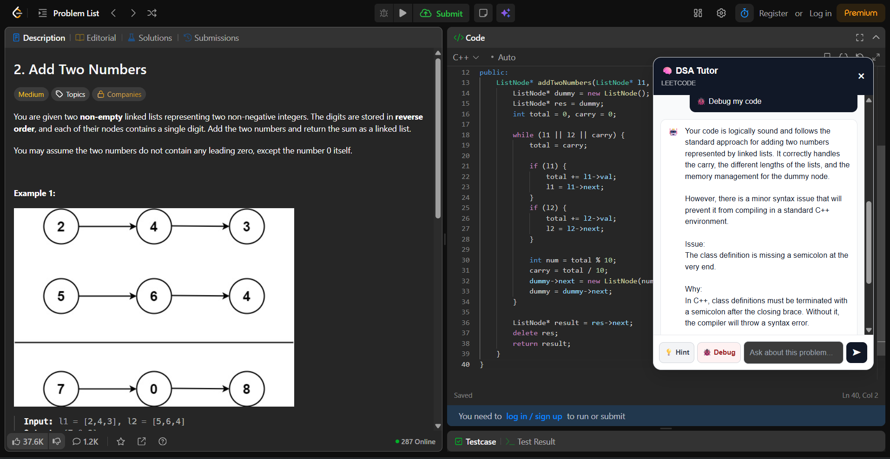
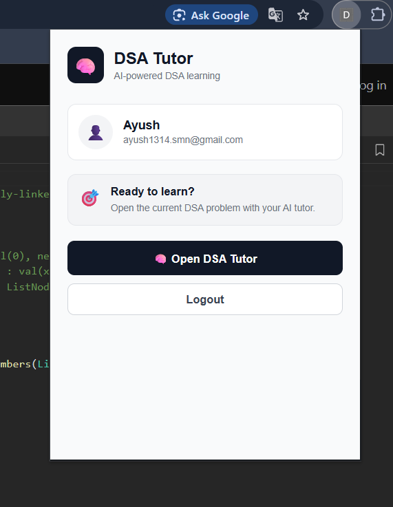

# 🧠 DSA Tutor — AI-Powered Coding Tutor

> An AI-powered Chrome extension that helps users solve **LeetCode and Codeforces problems** through problem-specific tutoring, progressive hints, code debugging, and persistent learning sessions.

---

## 📌 Project Overview

**DSA Tutor** is an AI-powered Chrome extension designed to act as an interactive DSA mentor while solving coding problems.

Instead of immediately providing a complete solution, DSA Tutor follows a **progressive learning approach**. It starts with guiding questions and gradually increases the level of assistance as the user requests more help.

The system combines a **Chrome Extension**, **Node.js + Express backend**, **Google Gemini API**, **JWT authentication**, and **MongoDB Atlas** to provide an interactive and persistent coding-learning experience.

---

## ✨ Features

### 🤖 AI-Powered DSA Tutor

- Understands the current coding problem automatically.
- Provides problem-specific explanations and guidance.
- Maintains conversation history during a session.
- Uses Google Gemini API for AI-powered tutoring.

### 💡 Progressive Hint System

The tutor provides hints in multiple levels instead of directly revealing the solution.

```text
Level 0 → Guiding Question
Level 1 → Conceptual Hint
Level 2 → Algorithm / Data Structure Hint
Level 3 → Detailed Approach
Level 4 → Pseudocode
Level 5 → Complete Solution
```
This approach encourages users to understand and solve the problem themselves.

### 🎯 Problem Relevance Detection

The system checks whether the user's question is related to the currently active coding problem.

- Relevant questions are passed to the tutor.
- Unrelated questions are rejected.
- Unrelated questions are not added to the problem's conversation history.

### 🐛 Code Debugging

DSA Tutor can analyze the user's current code and provide debugging guidance.

The extension can extract code from supported coding-platform editors and send it to the backend along with the detected programming language.

**Supported languages:**

- C++
- Java
- Python
- JavaScript

The tutor focuses on identifying issues and guiding the user toward fixing them rather than simply replacing the code with a complete solution.

### 📊 Progress Tracking

For each problem, the system tracks:

- Questions asked
- Hints used
- Debug attempts
- Current hint level
- Conversation history

### 💾 Persistent Problem Sessions

Each problem has its own learning session.

When the user returns to the same problem, the system can restore:

- Previous conversation
- Current hint level
- Questions asked
- Hints used
- Debug attempts

This allows users to continue learning from where they previously stopped.

### 🔐 User Authentication

The application includes:

- User registration
- User login
- JWT-based authentication
- Protected backend routes
- Logout functionality

### 🗄️ MongoDB Session Storage

User accounts and problem-solving sessions are stored using:

- MongoDB Atlas
- Mongoose

Sessions are associated with individual authenticated users and problems.

### ☁️ Backend Deployment

The backend is deployed on **Render** and communicates with the Chrome extension through HTTPS.

## 🏗️ System Architecture

```text
                         ┌──────────────────────────┐
                         │     LeetCode /           │
                         │     Codeforces           │
                         └────────────┬─────────────┘
                                      │
                                      ▼
                         ┌──────────────────────────┐
                         │     Chrome Extension     │
                         │                          │
                         │  Problem Extraction      │
                         │  Floating Tutor UI       │
                         │  Code Extraction         │
                         │  Progress Tracking       │
                         └────────────┬─────────────┘
                                      │
                               HTTPS REST API
                                      │
                                      ▼
                      ┌────────────────────────────────┐
                      │    Node.js + Express Backend   │
                      │                                │
                      │     ┌──────────────┐           │
                      │     │ Auth APIs    │           │
                      │     └──────────────┘           │
                      │                                │
                      │    ┌──────────────┐            │
                      │    │ Chat APIs    │            │
                      │    └──────────────┘            │
                      │                                │
                      │    ┌──────────────┐            │
                      │    │ Session APIs │            │
                      │    └──────────────┘            │
                      └────────────┬───────────┬───────┘
                                   │           │
                           ┌───────▼──────┐ ┌──▼────────────┐
                           │ Google Gemini│ │ MongoDB Atlas │
                           │     API      │ │               │
                           └──────────────┘ └───────────────┘
```
---
## 🔄 How It Works

### 1. Open a Coding Problem

The user opens a supported problem on LeetCode or Codeforces.

### 2. Launch DSA Tutor

The Chrome extension detects the current problem and displays the floating tutor interface.

### 3. Extract Problem Context

The extension extracts relevant information such as:

- Problem title
- Problem statement
- Platform
- Problem URL

### 4. Ask a Question

The user asks a question through the tutor interface.

The extension sends the problem context, conversation history, and user question to the backend.

### 5. Check Problem Relevance

The backend checks whether the question is relevant to the current problem.

```text
User Question
      │
      ▼
Problem Relevance Check
      │
 ┌────┴─────┐
 │          │
Relevant   Unrelated
 │          │
 ▼          ▼
Tutor     Reject
 │
 ▼
AI Response

```

### 6. Generate Tutor Response

For relevant questions, Gemini generates a response according to the current tutoring and hint level.

### 7. Request More Help

The user can request another hint.

The system progressively increases the level of assistance.

### 8. Debug Code

The user can activate the debugging feature to analyze their current code.

The extension extracts the code and sends it to the backend for AI-assisted debugging.

### 9. Save Session

The user's:

- Conversation
- Hint level
- Questions
- Hints
- Debug attempts

are stored in MongoDB Atlas.

### 10. Restore Session

When the user returns to the same problem, the stored session is retrieved and restored.

---

## 🧠 Progressive Learning Approach

The main goal of DSA Tutor is to encourage **problem-solving rather than solution copying**.

The assistance follows this progression:

```text
                 ┌─────────────────────┐
                 │  User encounters a  │
                 │       problem       │
                 └──────────┬──────────┘
                            │
                            ▼
                 ┌─────────────────────┐
                 │   Guiding Question  │
                 └──────────┬──────────┘
                            │
                       More Help
                            │
                            ▼
                 ┌─────────────────────┐
                 │  Conceptual Hint    │
                 └──────────┬──────────┘
                            │
                       More Help
                            │
                            ▼
                 ┌─────────────────────┐
                 │ Algorithm / DS Hint │
                 └──────────┬──────────┘
                            │
                       More Help
                            │
                            ▼
                 ┌─────────────────────┐
                 │ Detailed Approach   │
                 └──────────┬──────────┘
                            │
                       More Help
                            │
                            ▼
                 ┌─────────────────────┐
                 │      Pseudocode     │
                 └──────────┬──────────┘
                            │
                       More Help
                            │
                            ▼
                 ┌─────────────────────┐
                 │   Complete Solution │
                 └─────────────────────┘
```
---
## 🛠️ Tech Stack

### Frontend / Chrome Extension

- HTML
- CSS
- JavaScript
- Chrome Extension Manifest V3
- Chrome Storage API

### Backend

- Node.js
- Express.js
- REST APIs
- CORS

### Artificial Intelligence

- Google Gemini API
- `@google/genai`

### Authentication

- JSON Web Tokens (JWT)
- `bcryptjs`

### Database

- MongoDB
- Mongoose
- MongoDB Atlas

### Deployment

- Render

### Development & Testing

- Git
- GitHub
- Chrome DevTools
- Postman

---

## 📂 Project Structure

```text
dsa-tutor/
│
├── backend/
│   │
│   ├── config/
│   │   └── db.js
│   │
│   ├── controllers/
│   │   ├── authController.js
│   │   ├── chatController.js
│   │   └── sessionController.js
│   │
│   ├── middleware/
│   │   └── authMiddleware.js
│   │
│   ├── models/
│   │   ├── User.js
│   │   └── Session.js
│   │
│   ├── routes/
│   │   ├── authRoutes.js
│   │   ├── chatRoutes.js
│   │   └── sessionRoutes.js
│   │
│   ├── services/
│   │   └── hintService.js
│   │
│   ├── .env.example
│   ├── package.json
│   └── server.js
│
├── manifest.json
├── popup.html
├── popup.js
├── content.js
├── content.css
├── background.js
│
└── README.md

```
---
## 🔐 Authentication Flow

```text
                 ┌───────────────┐
                 │     User      │
                 └───────┬───────┘
                         │
                    Register/Login
                         │
                         ▼
                ┌─────────────────┐
                │ Express Backend │
                └────────┬────────┘
                         │
                         ▼
                ┌─────────────────┐
                │ MongoDB Atlas   │
                └────────┬────────┘
                         │
                         ▼
                  JWT Access Token
                         │
                         ▼
                ┌─────────────────┐
                │ Chrome Extension│
                └────────┬────────┘
                         │
                    Bearer Token
                         │
                         ▼
                Protected API Routes
```
- Passwords are hashed using bcryptjs before being stored.

- Protected API endpoints require a valid JWT token.

## 💾 Session Management

Each authenticated user's problem-solving session contains:

```text
Session
│
├── User
├── Problem Key
├── Problem Title
├── Platform
├── Problem URL
│
├── Conversation History
│   ├── User Messages
│   └── Assistant Messages
│
├── Hint Level
│
└── Session Statistics
    ├── Questions Asked
    ├── Hints Used
    └── Debug Attempts

```

A unique session is maintained for each:
```text
User + Problem
```
This prevents different users from accessing each other's sessions.

## 🔒 Security

Sensitive credentials are kept on the backend.

The Chrome extension does **not** contain:

- Gemini API key
- MongoDB connection string
- JWT secret

Environment variables are used for sensitive configuration.

Example:

```env
GEMINI_API_KEY=your_gemini_api_key
MONGO_URI=your_mongodb_atlas_connection_string
JWT_SECRET=your_jwt_secret
PORT=5000
```
- Never commit .env files or API keys to GitHub.
## 🚀 Local Installation

### Prerequisites

Make sure the following are installed:

- Node.js
- npm
- Google Chrome
- MongoDB Atlas account
- Gemini API key

---

### 1. Clone the Repository
```env
git clone https://github.com/haxk1298/dsa-tutor.git
```
```env
cd dsa-tutor
```
---
### 2. Install Backend Dependencies
```env
cd backend
npm install
```
---
### 3. Configure Environment Variables

Create a file:
```env
backend/.env
```
```env
GEMINI_API_KEY=your_gemini_api_key
MONGO_URI=your_mongodb_atlas_connection_string
JWT_SECRET=your_jwt_secret
PORT=5000
```
---
### 4. Start the Backend
```env
node server.js
```
The backend will run on:
```env
http://localhost:5000
```
Health check:
```env
http://localhost:5000/api/health
```
---
### 5. Load the Chrome Extension

Open Chrome and navigate to:
```env
chrome://extensions/
```
Then:

1. Enable **Developer mode**.
2. Click **Load unpacked**.
3. Select the DSA Tutor project folder.
4. Open a supported LeetCode or Codeforces problem.
5. Launch the DSA Tutor extension.

---

## ☁️ Production Deployment

The backend is deployed using Render.

### Production Backend
```env
https://dsa-tutor-backend.onrender.com
```
### Health Check
```env
https://dsa-tutor-backend.onrender.com/api/health
```
The Chrome extension communicates with the production backend through HTTPS.

---

## 🧪 API Overview

### Authentication

```text
POST /api/auth/register
POST /api/auth/login
GET  /api/auth/me
```
```text
POST /api/chat
```
### Sessions
```text
POST   /api/sessions
GET    /api/sessions
GET    /api/sessions/:problemKey
DELETE /api/sessions/:problemKey
```

Protected routes require:
```text
Authorization: Bearer <JWT_TOKEN>
```

## 🔮 Future Enhancements

- Chrome Web Store publication
- Support for additional coding platforms
- Advanced DSA learning analytics
- Topic-wise progress tracking
- Personalized learning recommendations
- More programming-language support
- Improved debugging capabilities
- Learning performance dashboards
---
## 📸 Screenshots

### 🧩 Extension Interface



### 💡 AI Hint System



### 🐛 Code Debugging



### 🔐 Authentication




---

## 🌐 Project Links

### GitHub Repository

```text
https://github.com/haxk1298/dsa-tutor
```
### Production Backend
```text
https://dsa-tutor-backend.onrender.com
```
### Chrome Web Store

Coming soon.

---
## 👨‍💻 Author

**Ayush Singh**